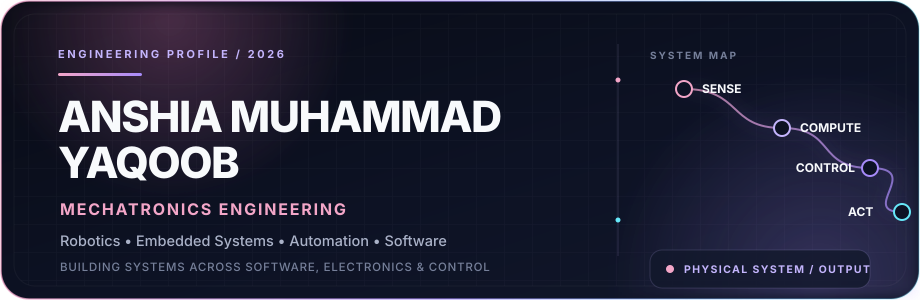
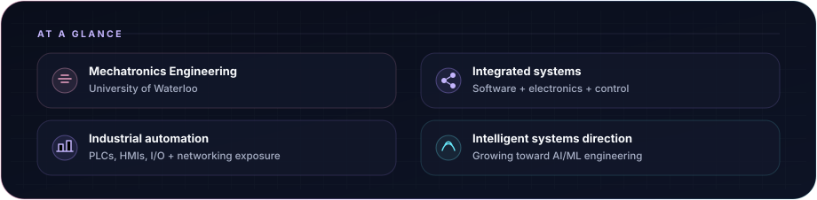
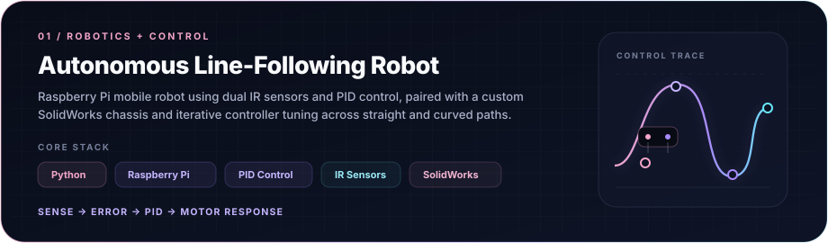
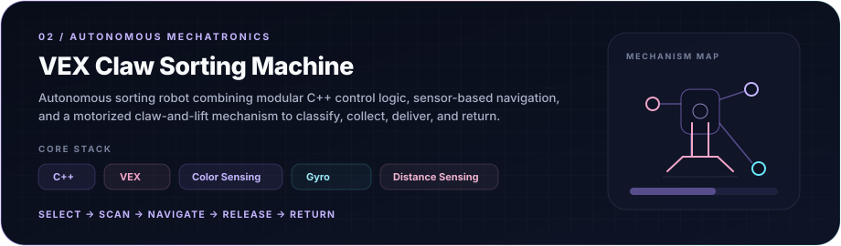
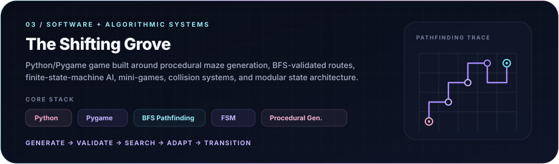
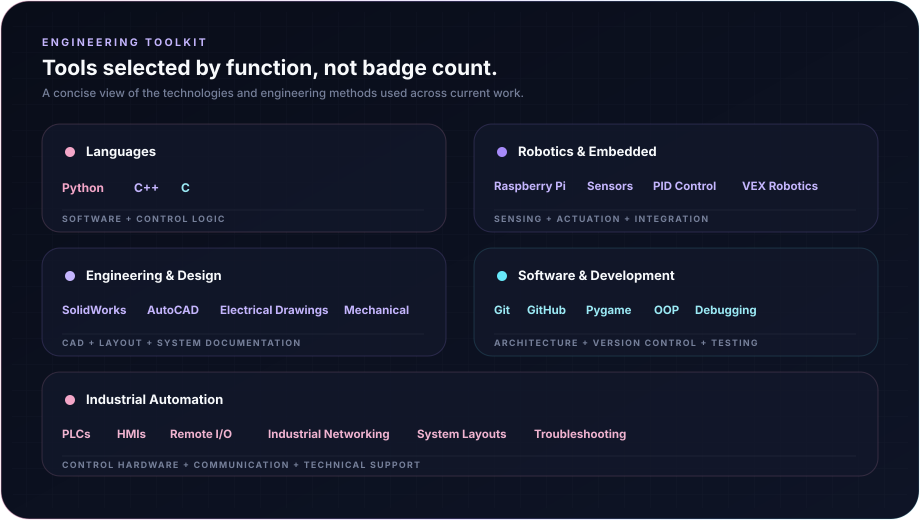
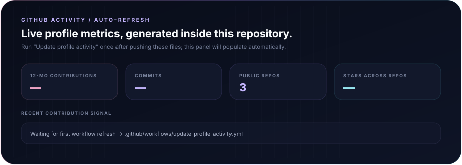

  

  <strong><a href="https://anshiamy.github.io/">Portfolio</a></strong>
  &nbsp;&nbsp;·&nbsp;&nbsp;
  <strong><a href="https://www.linkedin.com/in/anshiamy/">LinkedIn</a></strong>
  &nbsp;&nbsp;·&nbsp;&nbsp;
  <strong><a href="mailto:anshiayaqoob@gmail.com">Email</a></strong>

  

Featured Builds

<a href="https://anshiamy.github.io/projects/line-following-robot.html"><strong>View case study →</strong></a>

<a href="https://anshiamy.github.io/projects/claw-sorting-machine.html"><strong>View case study →</strong></a>

  <a href="https://github.com/AnshiaMY/The-Shifting-Grove"><strong>View source →</strong></a>
  &nbsp;&nbsp;·&nbsp;&nbsp;
  <a href="https://anshiamy.github.io/projects/the-shifting-grove.html"><strong>View case study →</strong></a>

Engineering Toolkit

  

GitHub Activity

<!-- Generated automatically by .github/workflows/update-profile-activity.yml -->

  

<a href="https://github.com/AnshiaMY?tab=overview"><strong>View contribution history →</strong></a>

  

  <a href="https://anshiamy.github.io/"><strong>Portfolio</strong></a>
  &nbsp;&nbsp;·&nbsp;&nbsp;
  <a href="https://www.linkedin.com/in/anshiamy/"><strong>LinkedIn</strong></a>
  &nbsp;&nbsp;·&nbsp;&nbsp;
  <a href="mailto:anshiayaqoob@gmail.com"><strong>Email</strong></a>
  &nbsp;&nbsp;·&nbsp;&nbsp;
  <a href="https://github.com/AnshiaMY"><strong>GitHub</strong></a>

